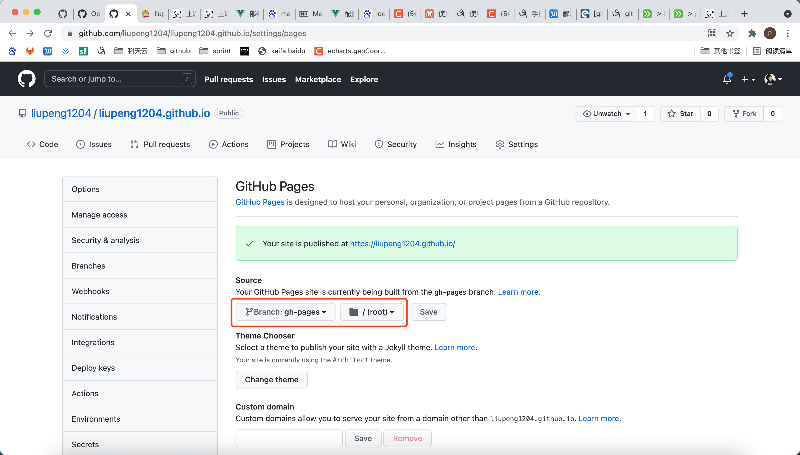
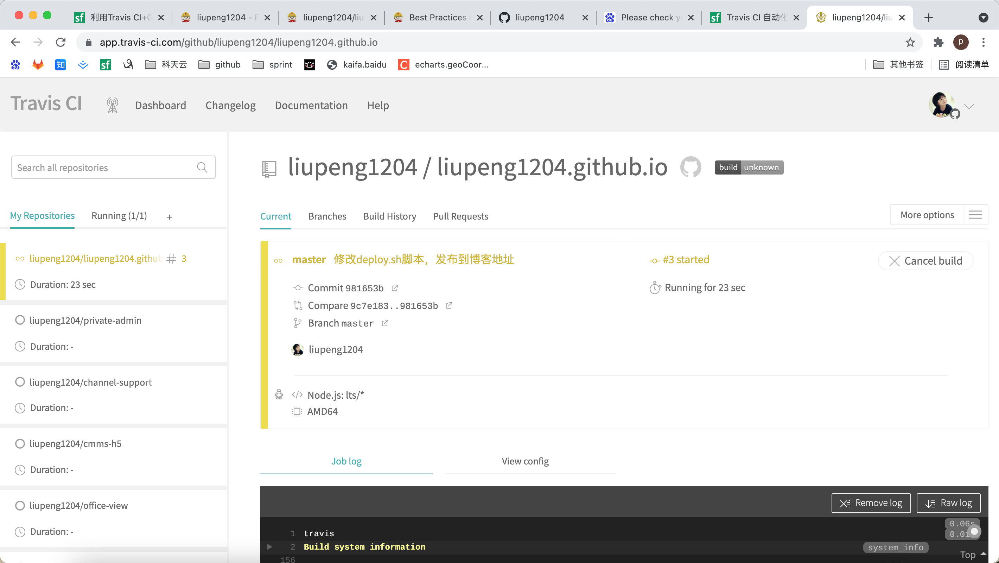
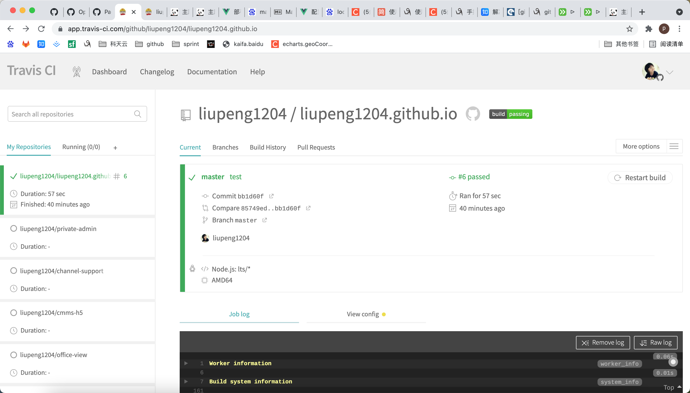

# vuepress + travis-ci 搭建自动化部署的个人博客

## VuePress
参考 https://vuepress.vuejs.org/zh/guide/getting-started.html
    https://vuepress-theme-reco.recoluan.com/views/2.x/

## Travis CI
### 1. 项目根目录增加deploy.sh文件
```shell script
#!/usr/bin/env sh

# 确保脚本抛出遇到的错误
set -e

# 生成静态文件
npm run build

# 进入生成的文件夹
cd docs/.vuepress/dist

# 如果是发布到自定义域名
# echo 'www.example.com' > CNAME

git init
git add -A
git commit -m 'deploy'

# 如果发布到 https://<USERNAME>.github.io
 git push -f git@github.com:liupeng1204/liupeng.github.io.git master

# 如果发布到 https://<USERNAME>.github.io/<REPO>
# git push -f git@github.com:<USERNAME>/<REPO>.git master:gh-pages

cd -

```
### 2. 增加.travis.yml文件，用于travis将build生成的dist文件推到git(新分支gh-pages)
```yaml
language: node_js
node_js:
  - lts/*
install:
  - yarn install # npm ci
script:
  - yarn build # npm run build
deploy:
  provider: pages
  skip_cleanup: true
  local_dir: dist
  github_token: $GITHUB_TOKEN # 在 GitHub 中生成，用于允许 Travis 向你的仓库推送代码。在 Travis 的项目设置页面进行配置，设置为 secure variable
  keep_history: true
  on:
    branch: master

```
### 3.登录travis官网https://app.travis-ci.com/，通过github账号授权；
    3.1 https://app.travis-ci.com/account/repositories 邮件active认证
    3.2 选择io项目，https://app.travis-ci.com/github/liupeng1204/liupeng.github.io/settings 配置GITHUB_TOKEN

## GitHub Pages 配置博客主页 https://github.com/liupeng1204/liupeng.github.io/settings/pages

## push到git，触发travis对应项目自动构建

## 等待1min左右自动构建完成

## 访问博客主页

